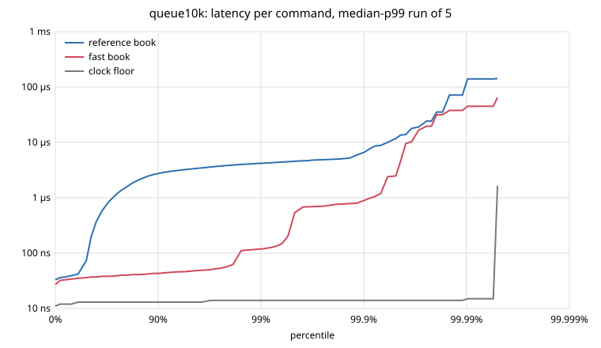

# lob benchmarks

Every number here comes from one session on one machine (D53), produced by `scripts/report.sh`. The raw output is in
[`bench/results/2026-10-08-0206/`](bench/results/2026-10-08-0206/), and every table names its file. Earlier milestones' numbers in
DESIGN.md were measured on other days and in other machine states, so compare only within this document. The percentile plots
come from a second session the same day ([below](#latency-percentile-plots-m12-d60)).

## Machine and method

| | |
|---|---|
| CPU | Intel i7-1165G7 (Tiger Lake, 4 cores / 8 threads, 12 MB LLC), laptop |
| OS | Linux 7.2.5, governor `powersave` with the `performance` energy hint (changing it needs root), turbo on |
| Build | rustc 1.99.0, release profile, commit `f6d1250` (the code measured; later commits only add the report) |
| Pinning | single-thread parts on cpu 2 (its SMT sibling, cpu 6, is not used by the benchmark, but nothing stops other processes from using it); the pipeline on cpus 1, 2, 3 (three physical cores) |

Method (D27, D55):
- Each part starts only after `scripts/quiet.sh` sees at least 85% CPU idle in two 2-second samples in a row.
- Each part records the load average when it ends, so a disturbance mid-part shows.
- Latency is `Instant::now()` around each `apply`, recorded in HdrHistogram. Each book gets an untimed warm-up pass, then 5 runs on fresh books, alternating the two books.
  The run shown is the one with the median overall p99.
- The **clock floor** is the cost of an empty timed window. It's also a frequency gauge: only runs whose floors are 13–15 ns count. Parts that broke a rule were re-run, and the re-runs are noted.
- The engine never reads a clock (D4). All timing lives in the harness.

**Not controlled:** the CPU governor and turbo, interrupts, and isolated cores (no `isolcpus`/`nohz_full`). This is a shared laptop:
other sessions' builds and GPU tests run here, which is why every part waits for a quiet machine.

## Workloads

| Journal | Commands | What it is |
|---|---|---|
| `gen2m` | 2,000,000 | D18's generator, seed 1, up to 5,000 live orders: a random-walk mid, 37% rejects |
| `deep200k` | 2,000,000 | the same generator with up to 200,000 live orders |
| `queue10k` | 20,000 | the worst case for cancels: 10,000 orders on one price, cancelled in random order |
| `aapl` | 1,356,940 | AAPL's ITCH flow on 30 July 2019, translated into commands (D54) |
| `spy` | 2,231,472 | SPY's ITCH flow, the day's busiest symbol by adds (983k) |

### Real flow as engine commands (D54) ([`translate.txt`](bench/results/2026-10-08-0206/translate.txt))
Adds become GTC limits, deletes become cancels, and partial cancels become modifies down. Each `E` execution becomes an IOC from the other side, at the named order's price.
Our engine then picks which order that IOC fills.

| | AAPL | SPY |
|---|---|---|
| ITCH messages → commands | 1,316,316 → 1,356,940 | 2,114,420 → 2,231,472 |
| Executions sent as IOCs | 59,179 | 55,538 |
| **IOC shares that filled the order NASDAQ named** | **98.68%** | **100.00%** |
| Shares that filled another order / nothing | 65,476 / 3,900 | 0 / 0 |
| Resync cancels, skipped commands, rejects | 68, 20, 0 | 0, 0, 0 |
| Orders left at the end of the day | 0 | 0 |

**Why AAPL isn't 100%:** in all 1,881 fills that hit a different order, NASDAQ filled an order with a *lower order reference* first,
even though it was displayed *later* than the order our FIFO filled. For example, in a sweep at 14:17:12, NASDAQ executed reference 78,481 (displayed 09:30:15) ahead of
reference 2,608,617 (displayed 06:19:12), and the whole sweep ran in reference order. So NASDAQ keeps priority from when an order was *entered*,
even if it was displayed later. That looks like orders entered before the session they're eligible for, and shown when that session opens. Our engine only knows arrival order.
Everything else about price-time priority agrees: SPY matches every share, and AAPL's out-of-turn fills cluster at a few moments: 09:30, 14:17, and after hours from 16:30.

## Throughput, single thread ([`throughput.txt`](bench/results/2026-10-08-0206/throughput.txt))
Best of 5 runs per book. "Apply" is `book.apply` alone. "Replay" adds encoding every event and hashing it (D17). The digests of the two books are equal on every journal.

| Journal | Reference, apply | Fast, apply | Speedup | Reference, replay | Fast, replay | Speedup |
|---|---|---|---|---|---|---|
| `gen2m` | 19.7 M/s | 30.7 M/s | 1.55x | 11.3 M/s | 14.1 M/s | 1.25x |
| `deep200k` | 17.9 M/s | 27.9 M/s | 1.56x | 9.4 M/s | 11.8 M/s | 1.25x |
| `queue10k` | 1.5 M/s | 29.9 M/s | **20.1x** | 1.4 M/s | 16.2 M/s | 11.4x |
| `aapl` | 12.0 M/s | 28.8 M/s | **2.40x** | 9.3 M/s | 15.5 M/s | 1.67x |
| `spy` | 13.0 M/s | 30.9 M/s | **2.37x** | 10.0 M/s | 17.4 M/s | 1.74x |

**Real flow widens the gap because of its mix, not because each command is harder.** The reference book's cancel is no slower on AAPL
than on generated flow (p50 95 ns vs 114 ns; see the latency tables). But real flow is 46–48% cancels and has no rejects, while `gen2m` is 12% cancels and 37% rejects. A reject costs
about 40 ns in either book, while a cancel costs 2–2.3x more in the reference book (its O(queue) scan and tree updates; D19–D21). The fast book runs at about 29–31 M/s on every journal.

## Latency per command, single thread
Nanoseconds, the median-p99 run of 5. "Kind" is what a command *did* (D26): `limit-rest` rested at least partly, `limit-cross` traded and finished,
`limit-kill` was an IOC/FOK left with nothing.

### AAPL ([`latency-aapl.txt`](bench/results/2026-10-08-0206/latency-aapl.txt), floors 14 ns in every run)

| Kind | Count | Reference p50 / p99 / p99.9 | Fast p50 / p99 / p99.9 |
|---|---|---|---|
| limit-rest | 669,325 | 80 / 184 / 466 | 50 / 88 / 513 |
| limit-cross | 59,143 | 66 / 161 / 352 | 55 / 111 / 460 |
| cancel | 626,536 | 95 / 256 / 771 | 44 / 87 / 259 |
| modify | 1,900 | 150 / 520 / 1,244 | 41 / 74 / 612 |
| **all** | 1,356,940 | **86 / 230 / 690** | **48 / 91 / 461** |

### SPY ([`latency-spy.txt`](bench/results/2026-10-08-0206/latency-spy.txt), floors 14 ns)

| Kind | Count | Reference p50 / p99 / p99.9 | Fast p50 / p99 / p99.9 |
|---|---|---|---|
| limit-rest | 1,106,199 | 74 / 168 / 769 | 48 / 90 / 506 |
| limit-cross | 55,538 | 60 / 166 / 719 | 51 / 109 / 452 |
| cancel | 1,062,153 | 93 / 167 / 815 | 41 / 76 / 164 |
| modify | 7,582 | 80 / 156 / 737 | 36 / 58 / 545 |
| **all** | 2,231,472 | **82 / 167 / 779** | **46 / 86 / 401** |

### Deep queue ([`latency-queue10k.txt`](bench/results/2026-10-08-0206/latency-queue10k.txt), floors 13–15 ns)

| Kind | Reference p50 / p99 / p99.9 | Fast p50 / p99 / p99.9 |
|---|---|---|
| limit-rest | 43 / 76 / 2,291 | 38 / 129 / 2,767 |
| cancel | **1,068 / 3,879 / 5,579** | **41 / 120 / 522** |

The reference cancel scans the queue (O(orders at the level)); the fast book unlinks from an intrusive list (O(1), D20).
The p99.9 of resting adds is high in both books (about 2.5 µs). With 10,000 adds that's the slowest 10, which is too few to read much into. Its cause hasn't been investigated.

### Generated flow (`gen2m`, `deep200k`)
[`latency-gen2m.txt`](bench/results/2026-10-08-0206/latency-gen2m.txt), [`latency-deep200k.txt`](bench/results/2026-10-08-0206/latency-deep200k.txt), second run in each file.
The first run's clock floors were 15–21 ns, outside the 13–15 band, so both were re-run. In the re-runs every floor is 14 ns and the five p99s are within 2–4% of each other.

| Kind | `gen2m` reference p50 / p99 / p99.9 | `gen2m` fast | `deep200k` reference | `deep200k` fast |
|---|---|---|---|---|
| limit-rest | 77 / 225 / 610 | 50 / 95 / 426 | 77 / 231 / 546 | 51 / 93 / 487 |
| limit-cross | 45 / 388 / 675 | 45 / 361 / 595 | 42 / 430 / 869 | 42 / 454 / 977 |
| limit-kill | 49 / 98 / 619 | 41 / 79 / 505 | 46 / 90 / 203 | 40 / 75 / 213 |
| market | 44 / 205 / 526 | 35 / 171 / 440 | 44 / 205 / 421 | 34 / 176 / 442 |
| cancel | 114 / 185 / 364 | 49 / 73 / 158 | 161 / 499 / 1,220 | 61 / 207 / 719 |
| modify | 133 / 366 / 818 | 60 / 154 / 454 | 210 / 631 / 2,555 | 80 / 250 / 786 |
| reject | 37 / 75 / 134 | 28 / 63 / 106 | 37 / 76 / 180 | 29 / 64 / 153 |
| **all** | **57 / 257 / 544** | **43 / 178 / 466** | **46 / 318 / 698** | **40 / 239 / 676** |

- **Crossing limits set the tail in both books, and the fast book doesn't help there** (p99 361–454 ns). A crossing order's cost grows with the
  makers it fills and the events it writes, and the books do that work the same way. The fast book's gains are in finding and changing one order:
  cancel and modify are 2–2.6x faster at p50.
- **A deeper book (200k live orders) mostly hurts the reference book's cancels and modifies** (p99 499 / 631 ns, against 185 / 366 at 5k live orders):
  longer queues to scan. The fast book's cancel p99 also rises (73 → 207 ns), which fits a larger working set missing cache, but that hasn't been measured with counters.

## Latency percentile plots (M12, D60)

A second session, the same day with the same method, measured the latency parts again and kept each median run's whole histogram:
[`bench/results/2026-10-08-0434/`](bench/results/2026-10-08-0434/) (commit `93d526c`; `machine.txt` there). Every clock floor is 13–15 ns.
`gen2m` was re-run once because one of its first five runs had a 20 ns floor; both runs are in its file, and the histograms are the second run's.
Against the tables above, the fast book's p99s moved by 1–7% (AAPL 92 ns, against 91; `deep200k` 256, against 239) and the
reference book's by 2–15% (`queue10k` 4,183, against 3,633). That's the run-to-run spread to expect between two sessions on this laptop.

The x axis adds a nine per step (90%, 99%, 99.9%...), so the tail gets as much room as the median. Both axes are logarithmic.
The grey line is the clock floor: an empty timed window, measured on the same core in the same run. `.hgrm` files are in HdrHistogram's standard format,
so they also load in its online plotter.

Plots for [`gen2m`](bench/results/2026-10-08-0434/latency-gen2m.svg), [`deep200k`](bench/results/2026-10-08-0434/latency-deep200k.svg)
and [`spy`](bench/results/2026-10-08-0434/latency-spy.svg) are in the same folder.

All commands, ns, read from the `.hgrm` files (each line is a bucket boundary, so these can be a few ns above the tables' p99):

| Journal | Reference p50 / p99 / p99.9 / p99.99 / max | Fast p50 / p99 / p99.9 / p99.99 / max | Clock floor p99.99 / max |
|---|---|---|---|
| AAPL | 82 / 245 / 785 / 2,989 / 277,503 | 46 / 94 / 380 / 2,573 / 359,679 | 204 / 107,455 |
| SPY | 78 / 165 / 676 / 9,727 / 138,623 | 44 / 89 / 386 / 8,439 / 124,415 | 442 / 18,447 |
| `gen2m` | 52 / 244 / 489 / 2,571 / 133,759 | 40 / 176 / 474 / 2,433 / 128,767 | 213 / 118,975 |
| `deep200k` | 45 / 358 / 999 / 10,319 / 566,271 | 39 / 266 / 847 / 7,875 / 195,711 | 1,282 / 128,447 |
| `queue10k` | 73 / 4,215 / 6,695 / 140,031 / 142,207 | 36 / 120 / 906 / 45,023 / 64,831 | 15 / 1,642 |

- **Up to p99.9 the fast book is lower on real flow:** about 2x at p50 and p99 on AAPL and SPY.
- **Past p99.99 the two books meet** on every journal except the deep queue, and the clock floor climbs with them (0.2–1.3 µs at p99.99, 18–128 µs max).
  An empty timed window can't be slow because of the code in it, so this part of the tail is the machine: interrupts, preemption, frequency changes.
  Making it smaller needs isolated cores (`isolcpus`, `nohz_full`), not a faster book. This is why the tables stop at p99.9.
- **The deep queue is where the structure shows across the whole curve.** The reference book's cancels scan the queue, so its line leaves the fast book's
  near p30 and reaches 4.2 µs at p99. The fast book stays at 36–120 ns up to p99. Only 20,000 commands, so above p99.9 each point is a handful of samples.

## Market data cost ([`feed.txt`](bench/results/2026-10-08-0206/feed.txt))
Apply, then publish level updates and trades, then encode (D40–D43). Fast book, best of 5, alternated with apply-only runs.

| Journal | Bytes per command | Apply | Apply + publish + encode | Recovery at 1% loss, 5% duplicates |
|---|---|---|---|---|
| `gen2m` | 27.8 | 32.1 ns | 108.7 ns (+77) | 19,030 gaps; 92 MB delivered for a 56 MB feed |
| `aapl` | 31.2 | 34.2 ns | 148.6 ns (+115) | 13,765 gaps; **1,137 MB** delivered for a 42 MB feed |
| `spy` | 30.6 | 29.6 ns | 119.5 ns (+90) | 22,332 gaps; 410 MB delivered for a 68 MB feed |

In every case the consumer's final book equals the engine's.
- **Publishing costs 3–4x matching.** Matching is about 30 ns, and building plus encoding the feed adds 77–115 ns per command.
- **Full-depth snapshots don't scale to real books.** AAPL's book reaches thousands of levels (4,711 at 16:00), so each gap's recovery snapshot is tens of KB.
  At 1% loss, recovery traffic is 27x the feed itself. Real feeds recover differently: a snapshot channel refreshed on a timer, separate from the incremental feed, or a
  request-only top-N snapshot. That's the next step if recovery cost matters.

## Pipeline: three threads vs one ([`pipeline.txt`](bench/results/2026-10-08-0206/pipeline.txt))
`gen2m` through gateway → matching → output (hashing and market data), on three physical cores, 3 runs each. Latency is measured from each command's *scheduled* time,
so a stall is charged to every command queued behind it (coordinated omission, D48). All digests equal the single-thread run.

| | One thread | Ring | `mpsc` |
|---|---|---|---|
| Flooding: throughput (3 runs) | 6.3–6.6 M/s | 4.96 / 4.96 / 5.03 M/s | 4.46 / 4.30 / 4.18 M/s |
| At 1 M commands/s: p50 (3 runs) | | 459 / 440 / 452 ns | 3,611 / 3,389 / 3,491 ns |
| At 1 M commands/s: p99 (3 runs) | | 433 µs / 7.6 µs / 9.4 µs | 657 µs / 38 µs / 145 µs |
| At 1 M commands/s: p99.9 (3 runs) | | 983 / 97 / 83 µs | 1,261 / 289 / 1,778 µs |

- **The ring's median is about 8x lower than `mpsc`'s.** `sync_channel` takes a lock and can park a waiting thread, and waking it goes through the kernel. The ring's waiting side spins first.
- **Three threads are still slower than one when flooding** (5.0 vs 6.5 M/s). The output stage dominates, and the hand-offs between cores cost more than the split saves (as in M9).
- **The first paced run of each channel has a p99 of about 0.4–0.7 ms.** One early stall leaves a backlog, and with scheduled-time stamps every command behind it is charged.
  Runs 2 and 3 show the steady state. The table shows all three so the outlier isn't hidden.

## ITCH replay, the whole day ([`itch.txt`](bench/results/2026-10-08-0206/itch.txt))
282,229,684 messages (8.66 GB uncompressed), cpu 2.

| Mode | Time | Rate |
|---|---|---|
| frame | 7.9 s | 35.6 M messages/s (1.09 GB/s) |
| frame + decode | 11.1 s | 25.5 M messages/s |
| rebuild every symbol's book (`ItchBook`, D37) | 82.7 s | 3.4 M messages/s |

The checks match M7: 0 hard errors, 0 orders left, every `E` at the best price, and 21 crossings, all inside cross-unwind windows.
The rates are 11–18% below M7's (43 / 29 / 3.8 M/s). The page cache was not controlled: the 8.7 GB file only partly fits in 15 GB of RAM next to other
sessions, so some of it was probably read from disk this time. Only the full rebuild is CPU-bound enough to compare, and it's within 11%.

## Microbenchmarks (criterion, D28)
[`criterion.txt`](bench/results/2026-10-08-0206/criterion.txt), second run. The first run overlapped another session's GPU test (load average 12 at its end; the fast book's
intervals were up to ±25%), so it was redone. One op on a book held at a fixed depth (50 levels a side, qty 1), timed in chunks of up to 100, cpu 2.
Criterion's estimate, with its 95% interval where it's wider than ±3%:

| Op @ depth | Reference | Fast | Speedup |
|---|---|---|---|
| add @ 10 | 38.7 ns | 30.7 ns | 1.3x |
| add @ 1,000 | 50.4 ns | 28.5 ns | 1.8x |
| add @ 100,000 | 96.1 ns | 32.2 ns | 3.0x |
| cancel @ 10 | 63.7 ns (60–68) | 30.6 ns | 2.1x |
| cancel @ 1,000 | 95.4 ns | 22.6 ns | 4.2x |
| cancel @ 100,000 | **518 ns** | **41.7 ns** | **12.4x** |
| match @ 10 | 41.1 ns | 32.3 ns | 1.3x |
| match @ 1,000 | 41.6 ns | 27.3 ns | 1.5x |
| match @ 100,000 | 48.8 ns | 46.7 ns (42–52) | 1.0x |

The fast book stays at 22–47 ns from 10 to 100,000 orders. The reference book's add grows 2.5x and its cancel 8x, because at 100k orders each level holds 1,000 orders and cancel scans the queue.
Matching is the same in both books: it takes the head of the best level, which both books reach directly.

## Summary
- **The fast book does 29–31 M commands/s on every workload, synthetic or real**, at a p50 of 45–50 ns and a p99 under 100 ns on real flow.
- **Against the reference book: 1.55x on generated flow, 2.4x on real flow, 20x on a deep queue.** The more cancels, the bigger the gap.
- **Our price-time matching agrees with NASDAQ on 98.7–100% of executed shares.** The rest is NASDAQ's entry-time priority for orders displayed late.
- **What costs the most isn't matching.** Market data (3–4x matching), the hand-offs between pipeline threads, and full-depth snapshot recovery on deep books all cost more.
