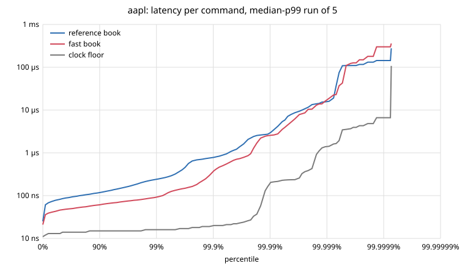

# lob

A limit order book and matching engine in Rust, built from scratch as a study of how exchanges match orders and how to make that
fast, deterministic and provably correct. It has price-time priority matching with the order types real venues offer (IOC, FOK,
post-only, self-trade prevention, icebergs), deterministic replay, crash recovery, a lock-free three-thread pipeline and an L2 market
data feed, and it uses a real NASDAQ trading day as test input. Two book implementations, a simple one and a fast one, must produce the
same events for every command, and every performance claim cites a measurement.

**Status:** active. Milestones M0–M15 are built (below); the next stage puts the engine on a network: a binary order-entry protocol over
TCP, wire-to-wire latency, multicast market data. Design decisions are logged as they're made in [DESIGN.md](DESIGN.md) (D1–D89).

## Results

| On one laptop core (i7-1165G7) | Fast book | Reference book |
|---|---|---|
| Throughput on generated and real order flow (4 journals) | **28–31 M commands/s** | 12–20 M/s |
| Latency per command on real AAPL flow, p50 / p99 | **48 / 91 ns** | 86 / 230 ns |
| Cancel in a 10,000-order queue, p50 | **41 ns** | 1,068 ns |
| Heap allocations per command, once warm | **0** | |

- **Matching agrees with NASDAQ:** replaying one trading day of AAPL and SPY, 98.7% and 100% of executed shares fill the same order NASDAQ's
  engine filled. The rest is NASDAQ's entry-time priority for orders it displays late, which an engine that only sees arrival order can't reproduce.
- **A whole NASDAQ day** (282M messages, every symbol's book rebuilt): 0 errors, 0 orders left at the end of the day, every execution message at the best price.

Sources: [BENCHMARKS.md](BENCHMARKS.md) (method, machine, every table tied to raw output in [`bench/results/`](bench/results/)),
and [DESIGN.md](DESIGN.md) for the allocation proof (D32) and the ITCH day (M7 results). The table was measured before self-trade prevention (M13)
and iceberg orders (M15), which cost the fast book about 4% and 3.5% on flow that uses neither
([M13 results](DESIGN.md#m13-results-2026-10-08), [M15 results](DESIGN.md#m15-results-2026-10-09)).



Up to p99.9 the fast book is about 2x lower. Past p99.99 the books meet, and so does the grey line, an empty timed window:
that part of the tail is the machine (interrupts, preemption), not the code. [More plots](BENCHMARKS.md#latency-percentile-plots-m12-d60).

## What it does

- **Orders:** limit and market orders; `modify` (cancel/replace with exchange priority rules: a reduction at the same price keeps its place,
  anything else goes to the back) and `cancel`. Time in force: GTC, IOC, FOK (all or nothing, checked before any fill), post-only.
- **Matching:** price-time priority, every trade at the resting order's price, integer prices in ticks, tick-size and max-quantity checks.
  Order ids must increase per session, which lets the engine drop a per-id history (D30).
- **Self-trade prevention:** an order can carry an STP group and an action: cancel newest, oldest or both. Two orders of one group never trade (D67–D73).
- **Iceberg orders:** `peak=<n>` shows n at a time. Each new slice goes to the back of its level, and one taker can take several slices.
  FOK counts the hidden quantity, market data shows only the slices (D83–D89).
- **Deterministic replay:** a checksummed binary command journal, and a sequence-numbered event stream whose 64-bit digest is the same on every run and machine.
- **Crash recovery:** `lob engine` journals each batch, fsyncs it once (group commit) and only then applies it, so no event is sent for a
  command a crash could lose. Atomic snapshots of the logical book plus the journal after them give the same digest as a run that never stopped (D74–D82).
- **Market data:** L2 level updates coalesced per command, with sequence numbers, heartbeats and snapshots; a consumer detects gaps and recovers (D40–D44).
- **Real data:** a NASDAQ TotalView-ITCH 5.0 parser that rebuilds every symbol's book for a whole day, and a translator that runs one symbol's
  real order flow through this engine (D35–D39, D54).

## Architecture

```
 journal file ──> gateway thread ──SPSC ring──> matching thread ──SPSC ring──> output thread
                  decode, stamp                 fast book: apply()             encode + digest
                                                Command in, Events out         L2 feed publisher
                                                no clock, no I/O               end-to-end latency
```

- **The engine is one call:** `apply(&Command, &mut Vec<Event>)`. It never reads a clock, never uses randomness and never iterates a hash map,
  so the same commands always give byte-identical events (checked by pinned digests).
- **The reference book** is a `BTreeMap` of `VecDeque`s, written to be obviously correct. It's the oracle for everything else.
- **The fast book:** a slab of 32-byte orders with an intrusive doubly linked list per price level (O(1) cancel), a tick-indexed price ladder
  with a two-level bitmap to find the best price, a cheap hasher for the id index, and no heap allocation once warm. Rarely used order
  attributes (an iceberg's hidden quantity) live in side tables, so the common case keeps two orders per cache line.
- **The pipeline:** a hand-written bounded SPSC ring (cache-line-padded indices, `Acquire`/`Release`). Its output equals one thread's byte for byte.
  At full load three threads are *slower* than one: the output stage dominates, and the hand-offs between cores cost more than they save.

## How correctness is checked

- **Two books, one answer:** the fast book is tested against the reference book event for event, over 15M commands (D22).
- **Oracles that don't trust the book:** an invariant checker after every command, and a ledger that rebuilds every order's open quantity
  from the event stream alone (D10, D13).
- **Scenario scripts** of commands and expected events ([tests/scenarios](tests/scenarios)), run against both books.
- **Property tests** (proptest): codecs round-trip and accept only canonical bytes, decoders never panic, a damaged journal never yields a changed command,
  the books agree on any session, a consumer survives any loss pattern (D49–D52).
- **Real data:** a NASDAQ ITCH 5.0 day rebuilt with zero errors (D38), and one symbol's flow translated into engine commands so our matching
  is compared with NASDAQ's (D54).
- **Fuzzing** (cargo-fuzz): every decoder of outside input (journal, feed, ITCH, text, snapshots) never panics and round-trips what it accepts (D65),
  and a differential target runs any bytes as a session on both books with the ledger watching (D89).
- **Miri** on the lock-free ring: no undefined behaviour or data races. Weakening any of its six `Acquire`/`Release` operations to `Relaxed`
  is caught, which no test on x86 hardware can do (D64).
- **Mutation checks:** every milestone plants bugs on purpose (72 for icebergs alone) and confirms a test catches each one; the survivors are
  written up, and each either gets a test or is shown to be harmless.

## Try it

Needs stable Rust (built with 1.99). Nightly is only for fuzzing (`cargo +nightly fuzz`) and Miri.

```bash
cargo test
cargo run
```

```
> limit 1 sell 100 10100
accepted 1
> limit 2 buy 30 10100
accepted 2
trade 2 1 buy 30 10100
> limit 3 buy 50 10050
accepted 3
> book
ask 10100 70 (1)
bid 10050 50 (1)
```

Prices are integer ticks (`10025` is $100.25 with a one-cent tick). A trade line reads
`trade <taker> <maker> <taker side> <qty> <price>`.

Orders 4 and 5 below share STP group 7, so they can't trade: order 5's action, cancel oldest (`co`),
cancels the resting order 4, and order 5 trades with the next ask instead.

```
> limit 4 sell 10 10090 g=7 stp=cn
accepted 4
> limit 5 buy 10 10100 g=7 stp=co
accepted 5
stp-cancelled 4 10
trade 5 1 buy 10 10100
```

Order 6 is an iceberg: 30 to sell, 10 showing at a time. Order 7 arrives later at the same price. A market buy takes the 60 left at 10100,
then order 6's slice; the next slice shows at the back of the level, so order 7 trades before it.

```
> limit 6 sell 30 10110 peak=10
accepted 6
> limit 7 sell 5 10110
accepted 7
> market 8 buy 75
accepted 8
trade 8 1 buy 60 10100
trade 8 6 buy 10 10110
replenished 6 10
trade 8 7 buy 5 10110
> book
ask 10110 10 (1)
bid 10050 50 (1)
```

Record synthetic order flow and replay it deterministically:

```bash
cargo run --release -- gen 1 20000 flow.jrnl
cargo run --release -- replay flow.jrnl events.bin
```

```
commands 20000  events 28834  trades 8316  rejects 5519
digest   f0cd0c4be21b0c27
```

The digest is the same on every run and every machine. It's pinned in the tests.

Measure it yourself (about 15 minutes, needs a quiet machine; the ITCH parts need NASDAQ's sample file, which isn't in the repo):

```bash
scripts/report.sh
```

## The `lob` command

| Command | What it does |
|---|---|
| `lob` | Interactive REPL on the reference book (`help` lists the commands) |
| `lob gen <seed> <n> <journal> [max-live] [stp-groups] [iceberg-pct]` | Write seeded synthetic order flow to a journal |
| `lob replay <journal> [events-file]` | Replay a journal: stats and digest |
| `lob bench <journal>` | Both books on the same journal: speed and matching digests |
| `lob latency <journal> [runs] [dir]` | Per-command latency percentiles for both books |
| `lob engine <input> <journal> <snapshot> ...` | Run the engine live with group commit and snapshots; recovers first if the journal exists |
| `lob recover <journal> <snapshot> [ref\|fast]` | Recover after a crash: snapshot plus journal tail, digests of events and book |
| `lob feed <journal> [drop-percent] [seed]` | Publish the L2 feed, with a consumer recovering over a lossy link |
| `lob pipeline <journal> [rate] [ring\|mpsc] [capacity]` | The three-thread pipeline against one thread |
| `lob itch <file[.gz]> [frame\|decode\|book\|dump\|top\|journal ...]` | Replay a NASDAQ ITCH 5.0 file |

`lob --help` prints every option.

## Code layout

| | |
|---|---|
| [`command.rs`](src/command.rs), [`types.rs`](src/types.rs), [`book.rs`](src/book.rs) | Commands, events, integer prices, the `OrderBook` trait |
| [`reference.rs`](src/reference.rs) | The reference book: `BTreeMap` of `VecDeque`s, obviously correct |
| [`fast.rs`](src/fast.rs), [`ladder.rs`](src/ladder.rs), [`hash.rs`](src/hash.rs) | The fast book, its price ladder, its id hasher |
| [`journal.rs`](src/journal.rs), [`replay.rs`](src/replay.rs) | Binary command journal, sequenced events, digest |
| [`snapshot.rs`](src/snapshot.rs), [`recovery.rs`](src/recovery.rs), [`engine.rs`](src/engine.rs) | Book snapshots, crash recovery, the live engine with group commit |
| [`scenario.rs`](src/scenario.rs), [`ledger.rs`](src/ledger.rs), [`gen.rs`](src/gen.rs), [`rng.rs`](src/rng.rs) | Test oracles and seeded order flow |
| [`feed.rs`](src/feed.rs), [`consumer.rs`](src/consumer.rs) | L2 market data out, and a consumer that recovers from gaps |
| [`ring.rs`](src/ring.rs), [`pipeline.rs`](src/pipeline.rs) | SPSC ring, three-thread pipeline |
| [`itch.rs`](src/itch.rs), [`itch_book.rs`](src/itch_book.rs), [`itch_flow.rs`](src/itch_flow.rs) | NASDAQ ITCH 5.0 parser, book rebuild, translation into engine commands |
| [`latency.rs`](src/latency.rs), [`plot.rs`](src/plot.rs), [`benches/`](benches/), [`scripts/`](scripts/) | Measurement harness, percentile plots, criterion, the report script |
| [`main.rs`](src/main.rs) | The `lob` CLI: REPL, `gen`, `replay`, `bench`, `latency`, `plot`, `feed`, `pipeline`, `itch`, `engine`, `recover` |
| [`tests/`](tests/), [`fuzz/`](fuzz/) | Scenario scripts, differential and property tests, crash tests, fuzz targets |

## Not built (yet)

No network gateway (input is a journal file, so every latency is in-process), one symbol, no auctions, no fully hidden, pegged or stop orders,
no risk checks beyond a fat-finger quantity limit, no replica to fail over to. [DESIGN.md](DESIGN.md#not-built-d61) says where each would go.

## Roadmap

Built, each with its decisions in [DESIGN.md](DESIGN.md):

- [x] **M0–M4** Core: command/event model, the reference book, order lifecycle (modify, IOC / FOK / post-only), deterministic replay
  with a golden digest, the fast book (identical events over 15M commands)
- [x] **M5–M6** Measurement and speed: latency histograms, criterion, `perf`; zero allocations per command, tick-indexed price ladder, cache-line layout
- [x] **M7–M9** Real data and plumbing: NASDAQ ITCH 5.0 day rebuilt, L2 feed with gap recovery, lock-free three-thread pipeline
- [x] **M10–M12** Proof and write-up: property tests, a reproducible benchmark report, percentile plots, Miri and fuzzing
- [x] **M13** Self-trade prevention
- [x] **M14** Crash recovery: snapshots, group commit, recovery proved at every crash point and against SIGKILL
- [x] **M15** Iceberg orders

Planned next (each starts with its own design review):

- [ ] **M16** Binary order-entry protocol (OUCH-like) over TCP, with sessions, sequence numbers and client order tokens
- [ ] **M17** Wire-to-wire latency: socket in to socket out, tuned one change at a time
- [ ] **M18** Market data over UDP multicast, with a TCP retransmit channel
- [ ] **M19** Tick-to-trade: a small market-making client that reads the feed and sends orders
- [ ] **M20** Pre-trade risk checks, and many symbols sharded across matching threads
- [ ] **M21** Deterministic simulation testing: simulated network and disk with seeded faults

Limits that will apply to the network numbers: one laptop, loopback only, no kernel bypass, no hardware timestamps.

## Documents

- [DESIGN.md](DESIGN.md): every decision (what, alternatives, why), with dated results for each milestone.
- [BENCHMARKS.md](BENCHMARKS.md): method, machine and every measured table, tied to raw output in [`bench/results/`](bench/results/).

## License

MIT (declared in `Cargo.toml`).
